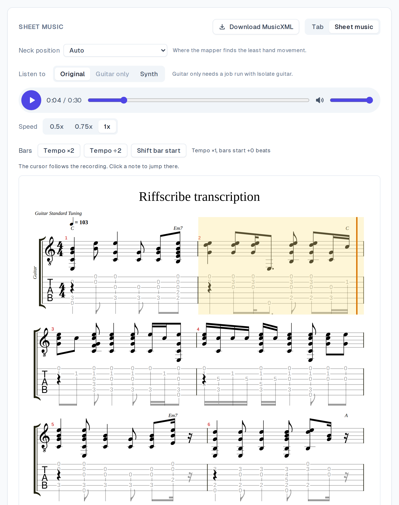
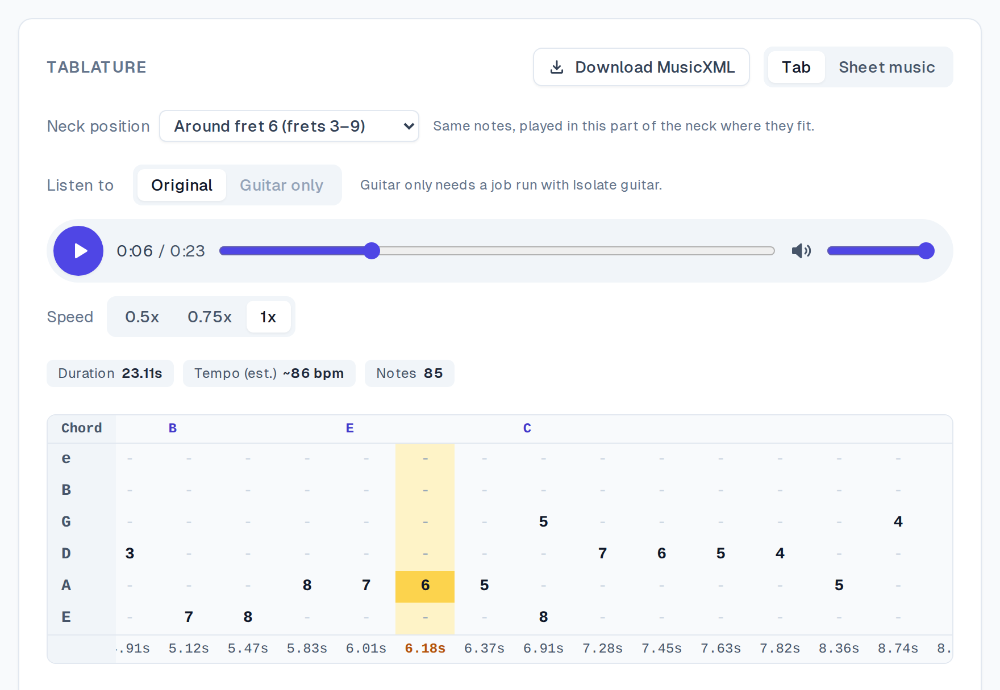
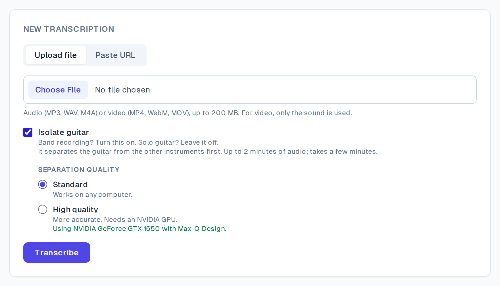
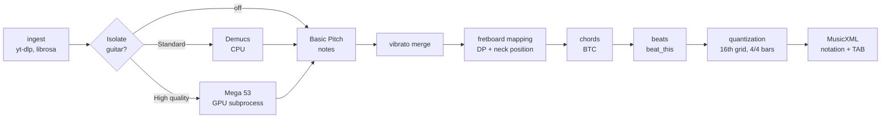

# Riffscribe

**Turn a guitar recording into tab and sheet music you can play along with.**

<!-- DEMO VIDEO: replace with the link once it's recorded -->
**Demo video:** _coming soon_

<!-- DEMO GIF: replace docs/images/demo.gif once it's recorded -->
_Demo GIF coming soon._

| Sheet music, cursor following the recording | Tab view, neck position "around fret 6" | Upload, with guitar isolation |
|---|---|---|
|  |  |  |

<sub>Screenshots: EGSet12 performances 06 and 12 (CC BY 4.0, see [Datasets](#datasets)).</sub>

## What it does

1. **Input:** an audio or video file, or a YouTube / SoundCloud link.
2. **Optional guitar isolation:** separates the guitar from a band before transcribing. **Standard** uses Demucs on the CPU. **High quality** uses MVSep Mega 53 on an NVIDIA GPU, and if it fails, the job falls back to Demucs rather than failing.
3. **Output:** a tab grid and sheet music (notation + TAB), with chord names, beats and bar lines.
   - **Listen to** the Original recording, the isolated guitar (Guitar only) or a Synth rendition, at 0.5x, 0.75x or 1x. The tab and the score cursor follow along.
   - **Neck position:** Auto, Open, or "around fret N". The same notes are re-placed in that part of the neck, without re-transcribing.
   - **Tempo ×2 / ÷2 and Shift bar start** fix the bar lines when the beat tracker gets the tempo or downbeat wrong.
   - **Download MusicXML** to open in MuseScore or Guitar Pro.

## Quick start

You need Docker (Docker Desktop, or Engine + Compose), about 12 GB of disk, and ports 3000, 8000 and 6379 free.

```bash
git clone https://github.com/JonathanmZhang/Riffscribe.git
cd Riffscribe
docker compose up -d --build        # CPU: everything except High quality isolation
```

To enable **High quality** isolation, use an NVIDIA GPU with about 3 GB of free memory and start the stack with the GPU override instead:

```bash
docker compose -f docker-compose.yml -f docker-compose.gpu.yml up -d --build
```

Open **http://localhost:3000**. To try it, choose **Paste URL** and paste this public-domain clip: `https://upload.wikimedia.org/wikipedia/commons/0/08/Guitar_tabulature_sample.ogg`.

- **Band recording → turn on Isolate guitar. Solo guitar → leave it off.** On a band mix, other instruments show up as extra notes. On solo guitar there's nothing to remove, and separation adds minutes.
- **First build:** 5–15 minutes. The worker image is about 5 GB (TensorFlow + PyTorch), and the GPU override adds about 8 GB.
- **First job:** 30–60 s, even for a short clip, while the models load and librosa compiles. Later jobs are much faster.
- **Separation speed:** on a 102 s song, Standard took 108–128 s on an 8-thread laptop CPU, and High quality took 164–169 s on a 4 GB GTX 1650. Isolation is limited to 2 minutes of audio, everything else to 5 minutes.

Setup details, every environment variable, the HTTP API and the measurement tools are in [docs/setup.md](docs/setup.md).

## Architecture



This is the logical order. In the code, chords and beats run in the `transcribe` task on the same audio as Basic Pitch. The fretboard mapping, quantization and MusicXML are pure-stdlib modules that the backend re-runs on every read. That's why the neck-position and bar controls apply instantly, without re-transcribing.

| Service | Role |
|---|---|
| `frontend` | Next.js 14 + TypeScript. alphaTab renders the score and plays the synth |
| `backend` | FastAPI. It accepts jobs (`202`), serves results, audio and MusicXML, and applies the display overrides |
| `worker` | Celery: `ingest_audio → transcribe → map_fretboard`, chained, sharing state through Redis by `job_id` |
| `worker-separation` | Celery `separate_guitar` on its own queue, one job at a time, optionally on the GPU |
| `redis` | Valkey 8: Celery broker and job state |

A job's `status` is always `queued`, `processing`, `done` or `failed`. Every task records its stage and turns any exception into a `failed` status with a clear message.

## Results

All numbers are measured on audio with known ground truth. Most come from [EGSet12](#datasets): 12 real electric-guitar performances with note-level annotations, scored as the right pitch within 50 ms. The tones are clean plus moderate and heavy *processed* distortion.

| What | Measured | What it means |
|---|---|---|
| **Notes**: recall / precision, clean · moderate · heavy | 71.8 / 85.2 · 55.8 / 80.9 · 38.2 / 72.1 | On clean guitar, about 7 in 10 real notes are found, and 85% of the notes shown are real. Distortion costs recall fast. |
| **Fret positions** (same string and fret as the player, Auto) | 53.3 · 48.3 · 45.4 % | The mapper minimizes hand movement. It doesn't know where the player's hand is, so about half its positions differ from the player's. |
| **Neck position**, best single window per song (truth's median fret ±3) | 53.3 → 69.3 · 48.3 → 65.8 · 45.4 → 66.1 % | One setting chosen by watching the video fixes much of that. On performance 12 it goes from 21.5 to 86.1%. |
| **Guitar isolation**, F1 on a full mix (clean guitar quieter than the band) | none 40.2 · Demucs 55.2 · Mega 53 73.1 (guitar alone 78.0) | High quality recovers most of the accuracy the band takes away. Standard helps precision but loses recall. |
| **Beats**, F-measure (beat_this vs librosa before it) | 70.1 vs 55.3 % (clean) | Noticeably better beats, but fast songs often come out at half tempo. |
| **Bar lines**, downbeat F (default 4/4 · with the right Tempo/Shift setting) | 50.4 · 68.2 % (clean) | Automatic bar lines are right about half the time. The two buttons fix most of the rest. |
| **Rhythm**: note starts on the right 16th | 97–98 % | Quantized onsets are reliable. Note lengths are weaker (67–73%). |
| **Vibrato merge** (IDMT-SMT-Guitar, real vibrato) | 130 false notes removed for 3 real ones | Vibrato no longer turns one note into a stutter of repeats. |

### Limitations

- **Bar lines are about 50% right automatically.** Beat slips, half tempo and wrong downbeats need a manual Tempo / Shift.
- **Heavy distortion is hard.** Recall drops to 38% on heavy processed distortion. Real amp recordings haven't been measured.
- **Standard tuning only.** Low notes in drop-D and other tunings are dropped as unplayable.
- **No bend or slide notation.** Basic Pitch splits a bend into separate semitone notes. Detection measured on real playing was too weak to ship (27% recall).
- **The full-mix benchmark uses a synthesized band** (General MIDI drums, bass, keys, pad), not real recordings. Real mixes are probably harder for both separators.
- Basic Pitch's own artifacts (phantom harmonics, octave errors) pass through.

## What I tried that didn't work

Each of these was built, measured and rejected. The numbers are in the branches and `experiments/*/README.md`.

| Approach | Evidence it didn't pay off |
|---|---|
| Hand-position fretboard mapper (DP over hand position, tuned with cross-validation) | Held-out position agreement only went from 53.2 to 55.8% on clean and fell on heavy (45.0 → 44.7). It also broke the up-the-neck passages. |
| Replacing Basic Pitch (MT3, YourMT3+, TabCNN) | MT3 scored F1 75.9 vs 78.0 on clean and took 262 s per song vs 5 s. YourMT3+ reached only 47% recall. |
| Time-stretching audio to 0.75x before transcription | Clean recall dropped from 76 to 50%, and transcription was about 3x slower. |
| Merging same-pitch "re-triggers" | Real re-strums look identical on onset and amplitude, so the merge erased real strums. |
| Gap-based chord splitting for fast changes | No completeness gain: those chords were already losing notes at detection. |
| Bar phase from chord changes | Every variant scored below beat_this's own downbeats (53.9%). |
| Glide merge (joining bends and slides) | On real playing it removed 138 false notes but also 44 real ones, and recall fell on every tone. |
| Snapping notes to the named chord's voicing | No gain on the mapper. |
| Lower confidence floor for quiet chord tones | Better on synthetic audio, but on real guitar it mostly added octave errors. |

## Licenses

Riffscribe's own code is [MIT](LICENSE). Third-party components keep their own licenses. They're installed from PyPI, npm, Debian or Docker Hub, or downloaded when the images are built. None is vendored into this repository.

| Component | Used for | License |
|---|---|---|
| [Basic Pitch](https://github.com/spotify/basic-pitch), TensorFlow | note detection | Apache-2.0 |
| [BTC](https://github.com/jayg996/BTC-ISMIR19) | chord names | MIT |
| [beat_this](https://github.com/CPJKU/beat_this) | beats and downbeats | MIT |
| [Demucs](https://github.com/facebookresearch/demucs) (code), [Music-Source-Separation-Training](https://github.com/ZFTurbo/Music-Source-Separation-Training) (code) | guitar isolation | MIT |
| PyTorch, librosa, soundfile, NumPy | inference and audio I/O | BSD-3-Clause / ISC |
| [alphaTab](https://github.com/CoderLine/alphaTab) 1.8.4 | score rendering and synth | MPL-2.0 |
| SONiVOX soundfont · Bravura font (bundled with alphaTab) | synth sound · notation font | Apache-2.0 · SIL OFL |
| FastAPI, Pydantic, Celery, Next.js, React, Tailwind CSS | app | MIT / BSD-3-Clause |
| [Valkey](https://valkey.io/) (Redis-compatible) | queue and job state | BSD-3-Clause |
| yt-dlp · FFmpeg | link ingestion · decoding (run as a separate program) | Unlicense · GPL |
| NVIDIA CUDA libraries (GPU override only) | Mega 53 on the GPU | NVIDIA proprietary |

### Separator weights

**This repository doesn't redistribute either separator's weights, and they aren't covered by its MIT license.** Each is downloaded from its publisher when you build the image, under the publisher's terms:

- **Demucs `htdemucs_6s`:** the maintainer states the weights "are not covered by the MIT license, and are provided only for scientific purposes" ([demucs#327](https://github.com/facebookresearch/demucs/issues/327)).
- **MVSep Mega 53:** a release asset of an MIT repository with no license statement of its own, downloaded from a pinned URL with a pinned SHA-256. The author hasn't confirmed whether the MIT license covers it.

Check both before deploying publicly or commercially. This is a reading of the published terms, not legal advice.

### Datasets

| Dataset | Used for | License |
|---|---|---|
| [EGSet12](https://zenodo.org/records/11406378) (Pedroza, Abreu, Corey, Roman; DAFx 2024) | the note, position, rhythm and full-mix benchmarks; the screenshots | CC BY 4.0 |
| [IDMT-SMT-Guitar](https://zenodo.org/records/7544110) V2, dataset 2 | vibrato, bend and slide measurements (local use only, not redistributed) | CC BY-NC-ND 4.0 |
| [Guitar tabulature sample](https://commons.wikimedia.org/wiki/File:Guitar_tabulature_sample.ogg) (Wikimedia Commons) | the try-it clip, early real-audio tests | Public domain |
| FluidR3_GM soundfont (with FluidSynth, LGPL-2.1) | synthetic chord test set | MIT |

No dataset audio or weights are committed. The benchmark scripts download or render them locally.
